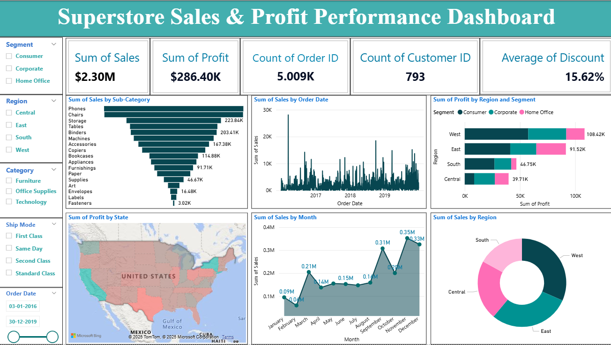
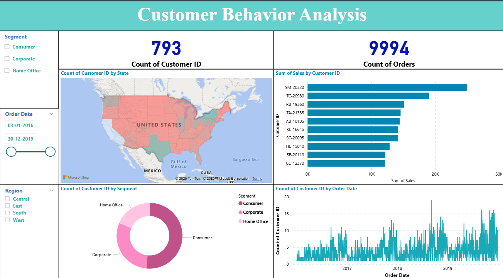

# Superstore Sales Insights: A Power BI Dashboard

🚀 **Project Title:** Superstore Sales Insights: A Power BI-Driven Retail Dashboard  
🏢 **Internship Organization:** Infotact Solutions  
🕒 **Duration:** 3 Months  
📊 **Tool Used:** Microsoft Power BI  
📁 **Dataset:** Sample US Superstore Dataset (Excel)

---

## 📌 Project Overview

As part of my internship at **Infotact Solutions**, I created an interactive Power BI dashboard project titled **"Superstore Sales Insights"**. The project analyzes US Superstore data to uncover actionable business intelligence across two key areas:

1. **Sales & Profit Performance**  
2. **Customer Behavior Analysis**

This dashboard aims to support retail business leaders in understanding performance trends and making data-driven decisions.

---

## 🧩 Dashboard Sections

### 1️⃣ Superstore Sales & Profit Performance Dashboard

- Overall **Sales, Profit, and Order Volume** KPIs  
- Regional performance across **States and Cities**  
- **Category/Sub-Category** sales analysis  
- **Trend Analysis**: Sales & Profit over time  
- **Shipping Cost Distribution** across locations  

### 2️⃣ Customer Behavior Analysis

- Customer Segmentation by **Region, Segment, and Category**  
- **Repeat Customer Trends**  
- **Order Frequency** and profit patterns by customer group  
- Insights on **purchase behavior** and high-value customers  

---

## 📷 Dashboard Preview

| Sales Performance | Customer Analysis |
|-------------------|-------------------|
|  |  |

---

## 🛠 Skills Applied

- Power BI (Data Modeling, Relationships, Measures)  
- DAX (Data Analysis Expressions)  
- Interactive Dashboard Design  
- Business Storytelling with Data  
- Visual Analytics & KPIs  

---

## 📂 Files Included

- `Superstore-Sales-Insights.pbix` – Main Power BI dashboard file  
- `Superstore-Sales-Data.xlsx` – Raw dataset used for analysis  
- `/images` – Screenshots of the dashboard pages  

---

## 🙏 Acknowledgments

Special thanks to the team at **Infotact Solutions** for their mentorship and continuous support throughout this project.

---

## 🔗 Connect with Me

- 💼 [LinkedIn](https://www.linkedin.com/in/arundham-jena-39as/) 
